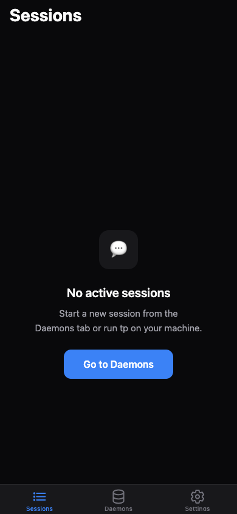
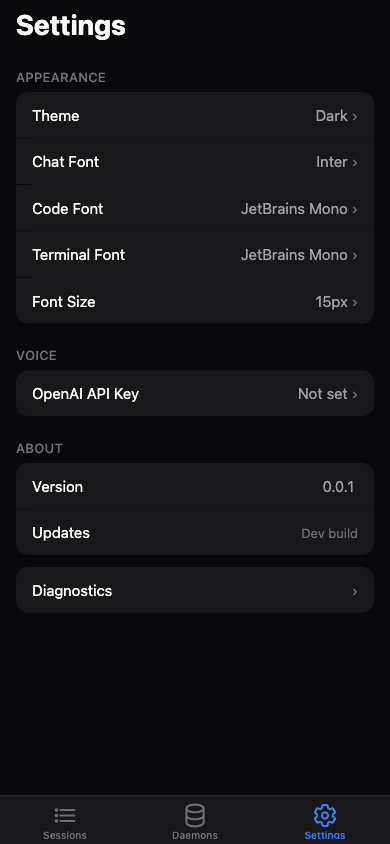
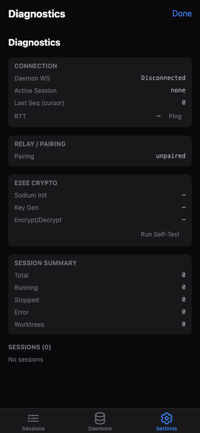

# Getting Started with Teleprompter

Teleprompter (`tp`) lets you control Claude Code sessions remotely from your phone or browser,
with end-to-end encryption, a dual Chat/Terminal UI, and voice input.

This guide walks you through installation, your first session, and connecting the mobile app.

## Prerequisites

| Requirement | Version | Check |
|-------------|---------|-------|
| **OS** | macOS or Linux | `uname -s` |
| **Claude Code CLI** | Latest | `claude --version` |
| **pnpm** (build from source only) | Latest | `pnpm --version` |
| **Bun** (build from source only) | 1.3.12+ | `bun --version` |

> **Note:** Windows support is experimental. See the main README for details.

## Quick Install

```bash
curl -fsSL https://raw.githubusercontent.com/DaveDev42/teleprompter/main/scripts/install.sh | bash
```

This downloads the latest `tp` binary to `~/.local/bin/tp`. If `~/.local/bin` is not in your
`PATH`, the installer will print the command to add it.

To verify the installation:

```bash
tp version
```

### Build from Source

```bash
git clone https://github.com/DaveDev42/teleprompter.git
cd teleprompter
pnpm install
pnpm build:cli:local    # outputs dist/tp for your platform
```

## Step 1: Run Your First Session

Use passthrough mode to run Claude Code through the tp pipeline:

```bash
tp -p "explain this codebase"
```

This spawns a Runner (PTY process), starts a Daemon in the background, and streams Claude's
output through the teleprompter pipeline. All `--tp-*` flags are consumed by tp; everything
else is forwarded to Claude.

You can also specify a session ID and working directory:

```bash
tp --tp-sid my-feature --tp-cwd ~/projects/my-app -p "add error handling to the API routes"
```

## Step 2: Check Status

See what's running:

```bash
tp status
```

This shows the daemon status, active sessions, and connection info. If the daemon isn't
running, `tp status` will auto-start it.

## Step 3: Connect Your Phone

Generate pairing data to connect the mobile app via the encrypted relay:

```bash
tp pair --relay wss://relay.tpmt.dev
```

This outputs a QR code and a pairing string. In the Teleprompter app:

1. Open the **Daemons** tab
2. Tap **Add Daemon**
3. Scan the QR code or paste the pairing string

The connection is end-to-end encrypted (X25519 + XChaCha20-Poly1305). The relay server
never sees your plaintext data.

## Step 4: Auto-start the Daemon

Install the daemon as an OS service so it starts automatically on login:

```bash
tp daemon install
```

This creates a launchd plist (macOS) or systemd unit (Linux). To uninstall later:

```bash
tp daemon uninstall
```

## Step 5: Run Diagnostics

Verify your environment, relay connectivity, and E2EE:

```bash
tp doctor
```

This checks:
- Claude Code CLI availability and version
- Daemon health
- Relay connectivity
- E2EE key exchange and encryption round-trip

## Using the App

The Teleprompter app has three main tabs:

### Sessions



The Sessions tab shows all active Claude Code sessions. When no daemon is connected, you'll
see the empty state above. Tap a session to open it in the dual Chat/Terminal view:

- **Chat tab** — structured conversation view with tool-use cards and streaming text
- **Terminal tab** — full PTY output rendered via ghostty-web

### Settings



Configure appearance (theme, fonts, font size), voice input (OpenAI API key), and check
the app version and OTA updates.

### Diagnostics



Tap **Diagnostics** at the bottom of Settings to open the diagnostics panel. Shows
real-time connection status, relay/pairing state, E2EE crypto self-test, and session
summary with per-session detail.

## CLI Reference

| Command | Description |
|---------|-------------|
| `tp [flags] [claude args]` | Run Claude through tp pipeline (default) |
| `tp pair [--relay URL]` | Generate QR pairing data |
| `tp pair list` | List registered pairings |
| `tp pair delete <id> [-y]` | Delete a pairing (notifies the peer app/daemon so it also removes the pairing) |
| `tp status` | Show daemon status and sessions |
| `tp logs [session]` | Tail live session output |
| `tp doctor` | Environment diagnostics |
| `tp upgrade` | Upgrade tp + Claude Code |
| `tp version` | Print version |
| `tp daemon start [opts]` | Start daemon in foreground |
| `tp daemon install` | Register as OS service (launchd/systemd) |
| `tp daemon uninstall` | Remove OS service |
| `tp relay start [--port]` | Start a relay server |
| `tp completions <shell>` | Generate shell completions (bash/zsh/fish) |

### Passthrough Flags

| Flag | Description |
|------|-------------|
| `--tp-sid <id>` | Session ID (default: auto-generated) |
| `--tp-cwd <path>` | Working directory (default: current) |

All other flags are forwarded directly to `claude`.

> Set `TP_UNPAIR_TIMEOUT_MS` (default 3000ms) to tune how long `tp pair delete` waits for a frontend to become reachable before giving up on the unpair notice. On slow networks, also bump `TP_UNPAIR_CONNECT_CUTOFF_MS` (default 1500ms) — the early-exit threshold for unreachable relays.

> **Tip:** Use `tp -- <claude args>` to forward arguments directly to Claude without the
> daemon pipeline. tp also forwards subcommands like `auth`, `mcp`, and `update` directly
> to Claude — run `tp <subcommand> --help` for details.

## Troubleshooting

**tp: command not found**
- Ensure `~/.local/bin` is in your `PATH`:
  ```bash
  export PATH="$HOME/.local/bin:$PATH"
  ```
  Add this to your `~/.zshrc` or `~/.bashrc` to make it permanent.

**Daemon won't start**
- Check if another daemon is already running: `tp status`
- Check logs: `tp logs`
- Run diagnostics: `tp doctor`

**Can't connect from the app**
- Ensure the relay URL is reachable: `tp doctor` tests relay connectivity
- Re-pair if keys have changed: generate a new QR with `tp pair`
- Check that your phone has internet access

**Sessions not appearing in the app**
- Verify the daemon is running: `tp status`
- Check the Diagnostics panel in the app for connection status
- Ensure pairing is active (Diagnostics > Relay / Pairing)

For more help, search [existing issues](https://github.com/DaveDev42/teleprompter/issues)
or open a new one on GitHub.
